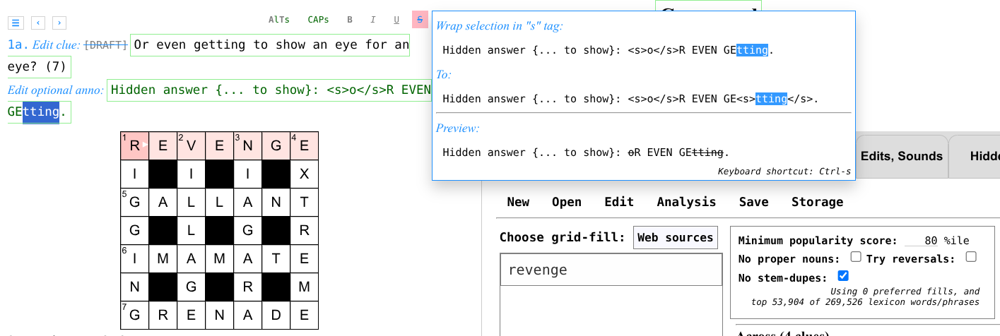

# Exet

## A web app for crossword construction

#### Version: Exet v0.94, October 6, 2024

#### Author: Viresh Ratnakar

Exet is free, open source software for setting crosswords.
You can use Exet from my serving site:

- English: [exet.app or https://viresh-ratnakar.github.io/exet.html](https://exet.app).
- Hindi: [https://viresh-ratnakar.github.io/exet-hindi.html](https://viresh-ratnakar.github.io/exet-hindi.html).
- Portuguese (Brazilian): [https://viresh-ratnakar.github.io/exet-brazilian.html](https://viresh-ratnakar.github.io/exet-brazilian.html).

You can also download and use/serve your own copy of the software. For that,
you need files from this repository as well as a few files from
[Exolve](https://github.com/viresh-ratnakar/exolve), the companion software
that enables interactive crossword solving in a browser.

These are all the files needed from this repository:

- [`exet.html`](https://raw.githubusercontent.com/viresh-ratnakar/exet/master/exet.html),
- [`lufz-en-lexicon.js`](https://raw.githubusercontent.com/viresh-ratnakar/exet/master/lufz-en-lexicon.js),
  - The above two files should be replaced by their language-specific variants, for the non-English
    languages that Exet supports:
  - Hindi:
    - [`exet-hindi.html`](https://raw.githubusercontent.com/viresh-ratnakar/exet/master/exet-hindi.html),
    - [`lufz-hi-lexicon.js`](https://raw.githubusercontent.com/viresh-ratnakar/exet/master/lufz-hi-lexicon.js),
  - Portuguese (Brazilian):
    - [`exet-brazilian.html`](https://raw.githubusercontent.com/viresh-ratnakar/exet/master/exet-brazilian.html),
    - [`lufz-pt-br-lexicon.js`](https://raw.githubusercontent.com/viresh-ratnakar/exet/master/lufz-pt-br-lexicon.js),
- [`exet.js`](https://raw.githubusercontent.com/viresh-ratnakar/exet/master/exet.js),
- [`exet-autofill.js`](https://raw.githubusercontent.com/viresh-ratnakar/exet/master/exet-autofill.js),
- [`exet-analysis.js`](https://raw.githubusercontent.com/viresh-ratnakar/exet/master/exet-analysis.js),
- [`exet.css`](https://raw.githubusercontent.com/viresh-ratnakar/exet/master/exet.css),
- [`exet-lexicon.js`](https://raw.githubusercontent.com/viresh-ratnakar/exet/master/exet-lexicon.js),
- [`about-exet.html`](https://raw.githubusercontent.com/viresh-ratnakar/exet/master/about-exet.html),
- [`exet-version.txt`](https://raw.githubusercontent.com/viresh-ratnakar/exet/master/exet-version.txt),
- [`no-unches.png`](https://raw.githubusercontent.com/viresh-ratnakar/exet/master/no-unches.png),
  [`t-unches.png`](https://raw.githubusercontent.com/viresh-ratnakar/exet/master/t-unches.png),
  [`l-unches.png`](https://raw.githubusercontent.com/viresh-ratnakar/exet/master/l-unches.png),
  [`tl-unches.png`](https://raw.githubusercontent.com/viresh-ratnakar/exet/master/tl-unches.png),
  [`no-blocks.png`](https://raw.githubusercontent.com/viresh-ratnakar/exet/master/no-blocks.png).

And here are the files needed from Exolve:

- [`exolve-m.css`](https://raw.githubusercontent.com/viresh-ratnakar/exolve/master/exolve-m.css),
- [`exolve-m.js`](https://raw.githubusercontent.com/viresh-ratnakar/exolve/master/exolve-m.js),
- [`exolve-from-puz.js`](https://raw.githubusercontent.com/viresh-ratnakar/exolve/master/exolve-from-puz.js).

Exet comes with a permissive MIT license. The full license notice is provided in
the [`LICENSE`](license) file as well as reproduced at the bottom of this file.

Exet has no library/package/software dependencies. You should be able to use it
from any modern browser. The experience may not be great on smaller screens like
phones, though. I would recommend using Chrome or Firefox on a desktop or laptop
computer, with Page zoom set to fill up your screen (125% for my setup).

Exet saves all revisions of all crosswords that you work on, in the browser's
local storage (you can back up all of Exet's local storage into a file). Exet
never sends your crosswords to wherever it might be getting served from.

You can download the crosswords that you create with Exet in the
[Exolve](https://github.com/viresh-ratnakar/exolve) format, in the .puz
format, and as PDFs. You can also grab embeddable HTML code for adding your
crossword to any web site or blog, using Exolve (but see the
[known caveats in the Exolve
documentation](https://github.com/viresh-ratnakar/exolve#exolve-widget)).

As of now, Exet only suggests English, Hindi, and Portuguese (Brazilian).
I'll add support for more languages over time.

I welcome [bug reports and feature
requests](https://github.com/viresh-ratnakar/exet/issues/new).
You may contact me via email too, at [viresh@exet.app](mailto:viresh@exet.app).
There's also a discussion group for the community:
["Exolve-Exet-Etc"](https://groups.google.com/g/exolve-exet-etc).

If you use Exet and like it, please consider posting links to it and/or writing
reviews, to help spread the word.

## Lexicon

### English

The list of English words used by Exet for providing grid-fill suggestions
is a modified version of the "UKACD" words list, which comes with its own
copyight notice that is reproduced near the bottom of this page. I made the
following modifications to the UKACD words list:

- Added a variety of words, idioms, proverbs collated from several web
  sources.
- Replaced all accented characters with non-accented ones.
- Deleted all punctuation characters other than spaces, hyphens, and
  apostrophes.
- Removed lots of swear words and offensive words.
- Attached a popularity score to each word/phrase using a
  dump of all of Wikipedia's English-language articles.
- Attached pronunciations (when available) using CMUdict.
- Created an index of the lexicon suitable for use by my JavaScript
  code. Source code for the last few steps is available in my
  [Lufz GitHub repository](https://github.com/viresh-ratnakar/lufz).
- I also added stemming info (offline, using the Porter2 algotithm
  implementation in
  [wink-porter2-stemmer](https://github.com/winkjs/wink-porter2-stemmer).
  Details are in the Lufz README file.

### Hindi

The Hindi lexicon, including popularity scores and pronunciations, is
taken from
[Verma et al. (2020) Shabd: A Psycholinguistic Database for Hindi.
(submitted).](https://osf.io/fygme/)

### Portuguese (Brazilian)

The Portuguese (Brazilian) lexicon was assembled from the following sources:

- The entries come from
  [Dictionary collection in Portuguese (pt-BR)](https://github.com/fserb/pt-br)
  by Fernando Serboncini. Its MIT License is copied below.
- Pronunciations are taken from
  [dicionario-fonetico](https://github.com/iwmo/dicionario-fonetico),
  which is derived from the
  [Common Orthographic Vocabulary of the Portuguese
  Language]("http://www.portaldalinguaportuguesa.org/index.php?action=fonetica&act=list").
- I trimmed away some swear words (using my English exclusion list).
- I added importance score using occurrences in Portuguese Wikipedia.
- The lexicon was huge, so I retained only entries that I found at least 1 occurrence for
  in Wikipedia.

### Using `exetLexicon` in other apps

The `exetLexicon` JavaScript object can be set up in other apps too,
by loading two script files.

- One of these language-specific files:
  - [`lufz-en-lexicon.js`](https://raw.githubusercontent.com/viresh-ratnakar/exet/master/lufz-en-lexicon.js)
  - [`lufz-hi-lexicon.js`](https://raw.githubusercontent.com/viresh-ratnakar/exet/master/lufz-hi-lexicon.js)
  - [`lufz-pt-br-lexicon.js`](https://raw.githubusercontent.com/viresh-ratnakar/exet/master/lufz-pt-br-lexicon.js)
- [`exet-lexicon.js`](https://raw.githubusercontent.com/viresh-ratnakar/exet/master/exet-lexicon.js)

This provides functionality such as getting anagrams, homophones, spoonerisms,
and words/phrases matching a pattern.

## Crossword construction walk-through

To use Exet, you simply open a link to `exet.html`, such as [this one on
my site](https://viresh-ratnakar.github.io/exet.html), in a browser.

The first time you open Exet, it might take a few seconds to load, as it fetches
a large (25 MB for English) lexicon file.

After it loads, your browser screen should look something like this:


Normally, Exet would start with the last crossword that you were working
on. When you open Exet for the very first time, it creates a 15x15
blocked grid of the British variety, with blocks added "automagically"
(see below). You can pass a URL option to default to a completely blank grid
as the first grid it creates:
[exet.html?newgrid=blank](exet.html?newgrid=blank).

There are three phases in crossword construction:

- Constructing the grid
- Filling the grid
- Providing the clues

Of course, setters often go back and forth and can overlap the phases (and Exet
certainly lets you do that). But a walk-through of Exet is perhaps best done by
separating out and describing these three phases individually.

For a demonstration of some of these steps, please check out this short,
introductory [tutorial video on YouTube](https://youtu.be/pDJ7bkImbWk),
made by Debsamita Basu.

### Constructing the grid

The "Open" menu allows you to start with blocked blank grids following a few
checkquered templates and the completely blank "No blocks" template. You will
also see a checkbox when creating a new blank grid, to "Add automagic blocks,"
and it will be checked by default (you can uncheck it if you do want to start
with a chequered template with no added blocks or with a completely blank
template). After creating a grid, you can customize it by manually
adding/removing blocks/bars, or by letting the software automatically add
blocks.

You can also create a 3-D grid from the "Open" menu. In a 3-D grid, there are
multiple "layers", with "down" clues running through the layers and "across"
and "away" clues within the layers. See the
[Exolve documentation](https://github.com/viresh-ratnakar/exolve/blob/master/README.md)
for details on 3-D crosswords.


- Add automagic blocks (#)
- Autofill:
  - _Leads to an autofill options panel._
- Accept autofilled entries (=)
- Edit grid cell:
  - Toggle block (.)
  - Toggle bar-after (|)
  - Toggle bar-under (\_)
- Mark grid cell:
  - Toggle encircling (@)
  - Toggle marking prefilled (!)
  - Toggle nina ($)
  - Toggle colouring (^)
  - Clear all markings!
- Clear current light (Ctrl-q)
- Clear all the lights! (Ctrl-Q)
- Reverse current light
- Add/edit special sections:
  - Preamble
  - Explanations
  - Questions
  - Other Exolve sections
- Preferences:
  - \[ \] Spellcheck clues/annos
  - \[ \] Allow asymmetry

For the actions that modify the grid in non-cosmetic ways (.|\_), symmetric
changes are automatically applied to the other end of the grid. This can be
turned off by checking the "Allow asymmetry" checkbox in the
"Edit → Preferences:" submenu. The chosen setting for this toggle will
persist for that particular crossword (but will reset to the default of
enforcing symmetry for a new crossword).

"Add automagic blocks" essentially adds some blocks to the grid, while
maintaining the British chequered format (that has no consecutive unchecked
cells) or the American format (that has all cells checked), whichever of the
two formats is the state of the grid at that time. "Add automagic blocks"
can be used repeatedly. More details on what "Add automagic blocks" does
are [provided in the appendix](#automagic-blocks).

You can also open a .puz file, or any existing HTML file that contains a puzzle
in the Exolve format (when you save such a crossword after editing it, the saved
Exolve file will replicate whatever is there before and after the Exolve part in
the original HTML file that you opened).

#### Reversing the current light
When you choose the option to reverse a light from the Edit menu, the
orientation of the cell is reversed. This entails the following direction changes:
- Across (a) ↔ Back (b)
- Down (d) ↔ Up (u)
- Across (ac) ↔ Back (ba) in 3-D
- Away (aw) ↔ Towards (to) in 3-D
- Down (dn) ↔ Up (up) in 3-D

When you reverse a light, you retain the clue (and annotation) that you might
have already written for it (but you will probably need to revise it!). You will
also retain any linked group that the light may be a part of (but the order of
cells in the group will change!). Reversing a light has no impact on other
lights/clues (except that their numbering may change).

### Filling the grid

You can fill any light by typing into its cells. You can also use grid-fill
suggestions shown to the right of the grid (in the "Exet" tab). These grid-fill
suggestions are ordered by their popularity in English Wikipedia articles.

The grid-fill suggestions include phrases and hyphenated words. When you pick
these, the clue enum is automatically adjusted. For example, for 1A, if you
pick "birds of a feather," then the enum will automatically change to
(5,2,1,7).

If you modify the enum part in the clue to something that indicates a multi-word
phrase (for example, by changing "(10)" to "(4,6)") then the grid-fill
suggestions will be reordered to prefer entries that match the implied
punctuation, i.e., the presence of interword space/dash/apostrophe characters.

To the right of the fill suggestions table, near the top, you have some
settings that control the nature of fill suggestions. These are:

- A minimum "popularity" threshold. The lexicon ("Lufz-en-v0.06"), as of
  May 2023, has 268,740 entries. Providing a popularity threshold
  can be useful to avoid obscure words as well as to make autofill go faster.
  If you are an experienced setter, you may want to set this to 0 to see the
  widest possible set of choices for each fill. This threshold is set to **80**
  by default. Here's a guide to the number of entries that you will limit to, at
  various thresholds (recall that popularity is derived from occurrences in
  Wikipedia articles):

  | Threshold | #Entries | Last included entries    |
  |-----------|----------|--------------------------|
  |       0   | 269,526  | The bells of Hell go ting-a-ling-a-ling |
  |       25  | 202,144  | involucels, nicht wahr |
  |       50  | 134,762  | potica, Naskhi |
  |       60  | 107,810  | toothaches, sociolects, minor canon |
  |       70  |  80,857  | trembled, die down, catfight |
  |   **80**  |**53,904**|**lor, prow, varus**        |
  |       85  |  40,428  | devious, culling, despatch  |
  |       90  |  26,952  | Suisse, gluten, flatter |
  |       95  |  13,475  | clocks, stimuli, World Bank |

- Whether to exclude proper nouns.
- Whether to avoid reusing words with common stems. This option only works
  for English. It's ON by default. If, say SWIM has been picked as a grid
  entry, then this option precents SWIMS and SWIMMING getting suggested
  for other unfilled entries (as well as in autofill).
- Whether to allow grid-fill suggestions (and autofill) to try to reverse
  lights (and linked lights). This is false be default for 2-D crosswords, and
  true by default for 3-D crosswords. When true, if there is a reversed
  grid-fill suggestion (shown with a ⇐ prefix in the list of suggestions)
  that you decide to accept, the light will be reversed (clue numberings may
  change). If the light is part of a linked group, the whole group will get
  reversed.

As you progress through filling the grid, the software will try to help by
showing viability indicators (I call them "viablots"). These are red circles
that appear in light cells that have only a few available grid-fill choices.
The bigger the size, the more constrained a cell is. If you find yourself
in a state where absolutely no viable grid-fill is possible for some cells
(at least from the lexicon the software is using), the viablots in such
cells will be large and coloured purple. Your best recourse at that point is
to back-track by clearing out some neighbouring grid-fills, or use some other
lexicon source to find a word/phrase that works. Instead of filling in lots
of large purple viablots, only a few are coloured in a stand-out fashion, and
the rest are coloured in a non-distracting, near-transparent manner.

The grid-fill suggestions shown for a light take into account a limited
amount of look-ahead. What that means is that the software evaluates
each candidate suggestion for a light (that matches its crossing letters)
by checking if the choice leads to a dead-end for any of the crossing
clues. This sweep to weed out non-viable grid-fill suggestions happens in
the background, and also updates the viablots. When this background sweep
is going on, a flashing red indicator is shown under the grid, in the
bottom-right corner. You may notice grid-fill suggestions getting
modified while such a sweep is going on. Grid-fill suggestions that lead
to dead ends are moved to the bottom of the list and are shown with a purple
background (and a warning tooltip).

When Exet determines (using its lexicon) that for some unfilled cell, exactly
one letter choice is viable, it shows that letter choice in gray. You can use
the Edit menu's "Accept autofilled entries" option to accept all such autofilled
letter suggestions.

You can provide up to 100 preferred words/phrases for using in the grid, by
clicking on the button labelled "Set preferred fills" in the Exet tab, just

Clicking anywhere outside the panel of preferred fills will dismiss the panel.

Similarly, you can provide a set of words that you do *not* want to appear
in the crossword, by clicking on the "Set fill exclusions" button.

Clicking anywhere outside the shown panel (for preferred fills or fill
exclusions) dismisses it.

#### Going back-and forth between filling the grid and changing the grid

Sometimes, setters design the grid first (or use a pre-designed grid) and then
fill it. But sometimes, setters choose to do the grid-design and the grid-fill
together. As mentioned above, entries that agree with the letters filled so
far but that are not viable towards a complete grid-fill (in the current state
of the grid) are still shown as possible choices for lights (albeit below the
viable entries, and with a distinctive purple background). Such entries may be
particularly useful for this use case, as you can select one of them that you
like, and then modify the grid itself to make it viable.

#### Autofill

You can click on "Autofill" in the "Edit" menu to try to get the software to
fill all remaining entries. This may take a few minutes, but you can monitor
the progress and intervene if needed: From the Autofill menu panel, you can
click on "Pause"  to pause the Autofill (clicking on "Start" will resume it).
You can accept or clear the Autofill suggestions by clicking on the "Accept"
/ "Clear" buttons, respectively, when Autofill is paused or has finished.

When Autofill is running, it won't stop just because of you moving away from
its control panel and hiding it (by moving the mouse out): you can return to
monitoring its status again by clicking again on "Autofill" in the "Edit" menu.

Note that Autofill tries to prefer words/phrases in the "preferred fills" list.
Autofill also respects the "fill exclusions" settings (min-popularity,
exclusion of proper nouns, as well as any entries in the explicitly forbidden
list) and the setting for allowing reversals.

If Autofill fails, you can try to rerun it a few times. It may succeed
on a subsequent run, because of the slight randomness in the choices that it
makes. If it fails consistently, you should reduce constraints by doing one
or more of:
- Increase "beam search" width (this allows it to explore more options,
  at the expense of speed).
- Reduce minimum word/phrase popularity threshold.
- Allow proper nouns if they have been disallowed.
- Allow reversals if they have been disallowed.
- Remove words/phrases from the "fill exclusions" list.
- Clear some previously filled entries.
- Break up some long lights by inserting blocks/bars.

You can ask Autofill to "Try to get a pangram" via an option on the Autofill
panel. This will try to fill the grid in a way such that every letter is
used at least once. The algorithm usually succeeds in doing this, especially
for British-style grids that have unchecked cells (but may take longer to
finish). If it fails then you can retry, and if that too fails to find a pangram
repeatedly, then you can try to reduce constraints as listed above. When
Autofill succeeds in finding a pangram, the Autofill panel displays "Pangram!"
near its bottom.

You can also try to restrict the pangram to a subset of cells by opening the
panel that says "Try to constrain the pangram to these cells:" and then
choosing some of these options:

- Checked
- Unchecked
- Circled
- Starts
- Ends

Do note that the more cells you allow as pangram cells, the more likely
you are to succeed in creating a pangram. When Autofill succeeds in
finding a pangram within any specified cell constraints, the Autofill
panel displays this at the bottom: "Pangram *with* constraints!".

Normally, if you've asked to try to get a pangram, and Autofill is able to
fill the grid completely but without getting a pangram, it will just stop. But
there's an option to "Loop until pangram", which will make Autofill keep trying
to get a pangram (with any cell constraints that you specified) until it
finds one, or until there is failure.

#### Autofill and pangram tips

- Autofill randomizes its choices to an extent. You can run it repeatedly
  to get different results every time, until you are satisfied with the fills.
- A good way to make use of Autofill is to stop it as soon as it picks a
  word that you do not like. You can then accept the suggestions and clear
  the word(s) that you do not like (you may also consider adding them to the
  "Set fill exclusions" list). Then, you can resume Autofill and repeat the
  process.
- U.S.-style crosswords (with doubly-checked cells) are harder to fill and are
  harder for the pangram algorithm. Working with fewer constraints for such
  grids (smaller popularity threshold, etc. as listed in the previous
  section) is better.
- If you monitor Autofill's progress and you can see that it is not making
  progress, you may want to pause, clear, and re-try (a smaller beam size
  might have made it fail faster in situations like this).

#### Web sources

The "Web sources" button is shown in the grid-fill choices area (only for
supported languages for which we have readily available web sources). This
lets you see additional fill choices from some web sources (currently only
for English). This may be a last-resort option to complete a grid-fill, when
no word/phrase from the lexicon fits. You have to use your own judgment to
decide whether a word or phrase obtained from a web source is usable, as
these matches may not necessarily be dictionary entries or common phrases.

For English, the web sources made available are Nutrimatic, Onelook, and Qat.
My personal experience is that Nutrimatic can sometimes find
common-enough-to-be-fair-in-crosswords phrases that are missing from the
lexicon.

After clicking on the "Web sources" button, you can dismiss the panel that
appears by clicking anywhere outside it. Pressing the Escape key should also
dismiss it most of the time (but some sites such as Onelook may grab input
focus, in which case the Escape key may not work: just click anywhere outside
the box if the Escape key does not work).

### Providing the clues

The clue for the entry in the current light is shown above the grid and can be
edited in place right there. You can navigate through the clues using standard
controls such as clicking on a cell or a clue, using the arrow keys, or
using the tab and shift-tab keys.

When you create a new crossword, all clues are set to be in "draft" mode and
are shown with a distinctive `[DRAFT]` marker. You should clear this marker
when you have set a clue and are satisfied with it. You can clear the marker
by clicking on the `[DRAFT]` marker for the current clue (above the grid).
You can always put a clue back in draft mode (if you realize it has some
issues), by clicking again on the ~~`[DRAFT]`~~ marker above the current clue.
In the clues list in the Exet panel (to the right of the grid), clues in
draft mode get shown with a `[DRAFT]` marker and their clue numbers get shown
coloured gray.

You can also edit the enum part of the clue, but the software will reset it
to the previous value if it does not add up to the needed number. For example,
if a light spans 10 cells, and you edit the enum part to be "(5-4)," the
software will reset it to "(10)," (or "(5,5)" or whatever was the last value).
When it does this, Exet will also surface a relevant tip under the "Tips"
area, showing how you can use `exolve-option: ignore-enum-mismatch` to avoid
this strict checking, if desired.
Note that when you save the crossword to Exolve or PUZ or PDF formats,
you can always chose to not list the enums (using a checkbox in the Save menu).

You can also leave an enum incompletely specified, as in these examples:
"(one word)", "(2 wds)". You can specify the total length and omit the
word break locations too, like this: "(9, two words)" or "(10, 3 wrds)".

When the enum does specify a length and it does not match the light length but
you *want* it like that (for example, in a variety cryptic where you're asking
solvers to delete or add some letters before entry, for some of the entries),
then you should use
*Edit -> Add/Edit special sections: -> Other Exolve sections* and add this line:
```exolve-option: ignore-enum-mismatch```
This will relax the requirement that enums have to match light lengths.

You can optionally provide annotations for clues. These annotations are
typically used in cryptic crosswords to describe the cryptic wordplay when
a solution to a clue is revealed.

The text-editing panel for the current clue/anno disables spellcheck by
default. You can turn it on or off through the "Edit → Preferences:"
menu. This setting persists in Exet, across different crosswords. Note that
if you change the setting, depending on some browser peculiarities, the
updated setting may only become active after you have navigated to a new
clue and/or clicked on the clue or anno.

##### Modifying the grid after some clues have been provided

If you make changes to the grid (such as adding/removing blocks/bars) that
result in a modified numbering of clues, any clues or annotations that you
may already have provided, for lights that survive the grid changes, will
remain intact. This is the case even when their clue numbers get modified
because of the grid changes. Moreover, any linked clues that you may have
created will survive (with automatic renumbering if needed), as long as
all the lights involved survive the grid change.

#### Formatting clues and annotations

Note that when editing the current clue or annotation, you are working with
raw HTML, and you can use any HTML tags for specialized formatting if you want
to. In particular, if you want to present a clue in verse form (a style
occasionally seen in jigsaw-style cryptic crosswords), you can insert
linebreaks by inserting `<br>` tags. Generally speaking though, clues in most
publications tend to _not_ make use of fancy formatting (except for some
italicization in some cases).

Annotations, on the other hand, _should_ make use of rich formatting, to
illustrate cryptic wordplay elements clearly.

You can wrap one or more parts of the clue using the special `~{...}~`
"def wrapper" that Exolve supports, for marking the "definition part" in a
cryptic clue. The wrapped text gets shown distinctively (with a green
underline, usually) when the solver reveals the solution to the clue.

The clues and the annotations are shown in the clues lists (to the right of
the grid, in the Exet tab)  with all the HTML markup properly rendered (and
all "def wrappers" shown in their revealed state).

When you select some text in the current clue or annotation, you can make use
of some formatting shortcuts via helper buttons that appear above and to
the right of the current clue above the grid. Hovering the mouse over a helper
button will show a preview of the changes it will make when clicked. The
following screenshot shows an example:



Some of these formatting shortcuts can also be applied with special keystrokes
after selecting some text in the current clue or annotation. Here is the list
of supported formatting shortcuts along with details including keystrokes (when
applicable).

| Format | Keystrokes | Context | Notes          |
|--------|------------|---------|----------------|
| Def | Ctrl-D | Clue | Toggles wrapping/unwrapping in the def wrapper, `~{...}~` |
| _I_      | Ctrl-I | Clue/Anno | Toggles wrapping/unwrapping in `<i>...</i>` |
| **B**        | Ctrl-B | Anno | Toggles wrapping/unwrapping in `<b>...</b>` |
| <u>U</u>   | Ctrl-U | Anno | Toggles wrapping/unwrapping in `<u>...</u>` |
| ~S~ | Ctrl-S | Anno | Toggles wrapping/unwrapping in `<s>...</s>` |
| CAPs   |  | Anno | Toggles capitalization of letters |
| **A**l**T**s   |  | Anno | Marks every odd letter as bold and in upper case |
| ~_*T*_~   |  | Clue/Anno | Clears formatting |

This feature is not intended to be a fancy WYSIWYG editor, and has some
idiosyncrasies:

- If you select some text that already contains some HTML tags (or the def
  wrapper), you do not get any shortcuts for adding more tags to it. However,
  you get a shortcut button for clearing the formatting in such a selection.
  Format clearing only gets rid of tags that are fully matched with closing
  tags within the selected text.
- If you select some text that is fully enclosed within a `<b>..</b>`,
  `<i>..</i>`, `<u>..</u>`, `<s>..</s>` tag, or in the `~{..}~` def wrapper,
  then the shortcut for that particular format will toggle it, clearing away
  the existing formatting of that specific type. However, it will do that by
  simply removing the enclosing tags, _even if you have not selected all the
  text enclosed by them_. This is to avoid the complication of having to
  close/reopen any other markup that might also be enclosing the current
  selection.

#### Linked clues

You can link clues, creating sequences of lights that make up a single solution
that is clued using the "parent" clue (the first one in the sequence). To
create such linkages, you can click on the clue number of the current clue,
which will bring up a panel through which you can add a linked clue to the
current clue. You have to specify the clue to be linked by providing its
number as well as direction suffix ("7d" or "9a" or "6u" or "13b" or—in
3-D—"7dn" or "9ac" or "8aw" or "12up" or "19ba" or "3to", etc.). The same panel
also provides a button for breaking up a group of
previously linked clues. When you break up a group of linked clues, any existing
clue text from them will also get deleted. Grid-fill suggestions as well as
autofill work as you might expect with linked clues.

When you add a linked clue that continues on from the last cell of the
current clue, then the enum does not double-count that cell. Similarly,
if you create a "snake" out of linked clues, where the last cell is the
same as the first cell, then we do not double-count that cell.

#### Resources for clues

When creating a clue for a word or a phrase, setters typically like to
look at the definition of the word/phrase, look at its synonyms, examples of
usage, pronunciation, and etymology. The "Research" tab lets you do that
by using reputed online resources, conveniently linking directly to the
word/phrase in the current light:

- **The Free Dictionary**: [thefreedictionary.com](https://thefreedictionary.com)
- **Wiktionary**: [en.wiktionary.org](https://en.wiktionary.org)
- **Merriam-Webster Dictionary & Thesaurus**: [www.merriam-webster.com](https://www.merriam-webster.com)
- **Onelook**: [onelook.com](https://onelook.com)
- **DictionaryAPI**: [api.dictionaryapi.dev](https://api.dictionaryapi.dev)
- **Etymonline**: [www.etymonline.com](https://www.etymonline.com)
- **Chambers Dictionary & Thesaurus**: [chambers.co.uk](https://chambers.co.uk).
  Note that Chambers now does not allow embedding their pages in
  iframes, so these links open in new tabs.

In addition, the "Research" tab lets you search
[cryptics.georgeho.org](https://cryptics.georgeho.org/), which is an excellent
database of published cryptic clues, for:

- Definitions that others might have used for an entry, in cryptic clues.
- Phrases from the clue that others might have used as cryptic indicators. In
  particular, if you have used a cryptic indicator that you're not sure about,
  this is an excellent research tool for checking whether any setters in
  published newspapers have used it in the same way. Only 1-word and 2-word
  phrases from the clue are searched for by default, but you can easily edit
  the SQL query to add any longer phrase that you may have used as an indicator.

For cryptic crosswords, there are some additional tabs that setters may find
useful. In all of these (other than "Lists"), the wordplay candidates are shown
for the entry in the currently selected light. However, you can generate wordplay
candidates for any other word or phrase, by editing the input field(s) near the
top in each tab. These tabs are:

- **Anagrams/()**: Shows anagrams and containments for the current entry
  ("fodder").
  - For anagrams, there is an interactive slot for drafting a
    tentative anagram—you can use that to craft composite/extended anagrams,
    as the software automatically updates anagrams of any unused letters from
    the fodder that have not yet been used in the draft, as well
    as anagrams of any extra letters in the draft that are not present in the
    fodder. The suggested anagrams include multi-word anagrams. Since each
    single letter is included as a word in the lexicon, the list of anagrams
    shown also includes anagrams of the fodder with just one letter left
    out.
  - Anagrams components that are present intact as subtrings in the fodder
    are shown in green. This means that single-letter parts are also shown
    in green.
  - Anagram components are marked with `*` (anagram) or `<<` (reversal) or
    nothing, as appropriate, depending upon how they are seen in the fodder.
  - Containments (A around B) are shown in a tabular form showing all
    anagrams of A and B. The anagram colouring/annotating scheme described
    above is used here too.
- **Charades/-**: Shows candidate charades and anagrammed deletions.
    - Anagrammed deletions (`*(A - B*)`) are shown together above charades
      (for convenience: you can easily scroll past them if needed). Anagrammed
      deletions include the common special case where the anagrammed part has
      one extra letter than the fodder. Anagrammed deletions are sorted to
      show shorter deletions first.
    - Charades are listed in decreasing order of the average length of
      components.
    - For short fodders, you'll find more anagrammed deletions than charades,
      and the for long fodders, you'll find more charades. 
    - We try to avoid duplicating what's already covered by
      anagrams/containments, so these are generally not included in charades.
    - The anagram colouring/annotating scheme described above is used here too.
- **Edits, Sounds**:
  - Shows candidate wordplays for deletion, insertion,
    substitution (direct, not anagrammed), sorted in increasing order of a
    kind of edit distance (sum of lengths of deletions, insertions,
    substitutions, with the length of a substitution being the max of the plus
    and minus term lengths).
  - Also shows homophones and Spoonerisms (derived using the Carnegie Mellon
    Pronouncing Dictionary—see their copyright notice at the end of this
    document).
- **Hidden**: Uses [nutrimatic.org](https://nutrimatic.org) to show meaningful
  "hidden word" and "reversed hidden word" wordplay possibilities for the
  entry in the current light. Setters can tweak the wordplay as they choose.
- **Alternations**: Uses [nutrimatic.org](https://nutrimatic.org) to show
  "alternation" and "reversed alternation" wordplays for the entry in the
  current light.

  <details>
    <summary>
      <b>Tips on using nutrimatic.org for Hidden/Alternations</b>
    </summary>

    - Hidden answer and Alternation searches in Exet are simply links
      to nutrimatic searches. If these searches do not produce results,
      or if you want to impose additional/different constraints, then
      you may want to learn how to tweak the search queries (you can
      edit them directly in the search box shown in Exet). Here's the
      [relevant documentation on nutrimatic.org](https://nutrimatic.org/2024/usage.html).
    - The first thing to try is to click (repeatedly) on the "Try harder"
      link that is shown. In my experience, complex Alternations sometimes
      show up only after the third or fourth "Try harder" click! The
      "Try harder" clicks may eventually show an error message, in
      which case you may want to tweak the query.
    - Exet composes the most generic search queries for nutrimatic, by
      default. For example, for the entry CREATED, for finding a hidden
      answer possibility, Exet crafts this query:

      > [`https://nutrimatic.org/?q=A*"Ac"reate"dA"A*`](https://nutrimatic.org/?q=A*"Ac"reate"dA"A*)

      The query uses `"Ac"` to indicate that we want something that has
      some letter before the `c`, and with no intervening space. This yields
      no results, as the constraints prove too computationally expensive
      for nutrimatic. But you can help nutrimatic by guessing that there
      may be possibilities where the `at` in the middle is split out as
      a single word, with something preceding it (ending in `cre`) and
      something following it (beginning with `ed`). The following query
      does show possibilities (after a few "Try harder" clicks!) such as
      `massacre at Edinburgh`:

      > [`https://nutrimatic.org/?q="AA*cre at edAA*"`](https://nutrimatic.org/2024/?q=%22AA%2Acre%20at%20edAA%2A%22)

    - For alternations, the default is to search for "every-second-letter"
      possibilities. But if you want to search for "every-third-letter"
      possbilities (say), then you can modify the query to be somthing
      like this:

      > [`https://nutrimatic.org/2024/?q=cAArAAeAAaAAtAAeAAd`](https://nutrimatic.org/2024/?q=cAArAAeAAaAAtAAeAAd)

  </details>

- **Lists**: This is not specific to the current light. This tab provides
  convenient links to curated lists of wordplay indicators (for wordplays of
  various types) and cryptic abbreviations. The sources are:
  [Crossword Unclued](https://www.crosswordunclued.com), Wikipedia,
  [Mythic beasts (updated)](https://longair.net/mark/random/indicators/),
  [Clue Clinic](http://www.clueclinic.com/index.php/clinical-data/), and
  [cryptics.georgeho.org](https://cryptics.georgeho.org/).
  - You can highlight certain words when looking at any of these lists, by
    supplying a keyword and selecting a highlighting option from the menu
    next to the List selection menu. This can be very useful to craft natural
    (and deceptive!) cryptic clue surfaces. For example, you can highlight
    anagrinds related to *alcohol* (*abuse*, *drunk*, *production*, etc.
    would get highlighted). This feature is powered by the
    [Xlufz web service](https://github.com/viresh-ratnakar/xlufz)
    that I host at [xlufz.ratnakar.org](https://xlufz.ratnakar.org).

### Final touches

Do give your crossword a meaningful title, and provide your name/pseudonym as
the setter. These fields can be seen at the top of the page and can be directly
edited. Similarly, you can edit the copyright notice for the puzzle. All three
of these editable fields are optional, and you can simply edit them to be
empty.

### Downloading Exolve or .puz files

The "Save" menu lets you download or grab the puzzle in various ways. In the
following, \<title\> in a filename stands for the puzzle title.

- **Download PUZ file (exet-\<title\>.puz)**: Download a .puz file. Note that
  .puz does not support many crossword features (afaik) such as barred grids.
  The software will alert you if it is not able to provide a .puz download.
  Note also that when exporting the crossword in the .puz format, any rich
  formatting in clues will get stripped out as the .puz format does not support
  it (.puz does not support annotations either).
- **Download Exolve file with solutions
  (exet-exolve-\<title\>-with-solutions.html)**:
  Download an HTML file that uses Exolve and that allows solvers to check/see
  solutions.  Such files can also be opened by Exet from the "Open" menu and
  can be further edited. This might be useful, for example, when you want to
  edit an old crossword that you have deleted from Exet's limited local storage.
- **Download Exolve file without solutions
  (exet-exolve-\<title\>-sans-solutions.html)**:
  Download an HTML file that uses Exolve and does not allow solvers to check/see
  solutions.
- **Copy Exolve widget code with solutions 📋**: Copy (into the clipboard)
  embeddable Exolve widget HTML code (with solvers able to check/see solutions).
- **Copy Exolve widget code without solutions 📋**: Copy (into the clipboard)
  embeddable Exolve widget HTML code (with solvers not able to check/see
  solutions).
- **Print or download PDF file with solutions**: Print the crossword, or save
  it as a PDF file, in a compact, two-column format, with solutions.
- **Print or download PDF file without solutions**: Print the crossword, or save
  it as a PDF file, in a compact, two-column format, without solutions.

In the first three "download" variants, a file with the name shown will be
downloaded into the browser's Downloads directory/folder. If there already
exists a file with that name, the system will use a variant of the name
as per its usual conventions.

The Save menu also lets you change a couple of settings:

- **Show enums in clues**: You can turn this off to download American-style
  puzzles that do not show enums in clues.
- **Exolve URL prefix**: You can change this to your own custom location
  of the `exolve-m.css` and `exolve-m.js` files in downloaded Exolve files.
  You can press the Escape key inside the text entry area to revert to the
  default value of `https://viresh-ratnakar.github.io/`. Note also that if you
  load an existing HTML file containing an Exolve-formatted puzzle, then when
  you modify the puzzle and download as Exolve subsequently, the downloaded
  file will simply copy everything (other than the modified puzzle specs)
  from the original file, including the URL prefix (i.e., this setting will
  not get used).

These Save settings are sticky: Exet saves their current values in local
storage.

The Save menu shows warning messages if the crossword has unfilled entries
or has clues still in `[DRAFT]` mode. For clues in `[DRAFT]` mode, the
prefix "[DRAFT] " is shown in the downloaded/printed versions of the crossword
(as noted earlier, you can clear the `[DRAFT]` marker from the current clue
by clicking on it, when it is being edited above the grid).

### Going back to older versions

The "Open" menu lets you pick any old revision of any crossword. It also shows
a preview of the puzzle revision that you select.

Browsers typically limit the amount of local storage (5 MB in Chrome as of
May 2023). When this limit is reached, Exet will warn you that it cannot
save crossword revisions. You can use the "Manage storage" menu option in the
"Open" menu at any time to delete old revisions of some crosswords and/or
entirely delete old crosswords (after downloading Exolve files with solutions
for them as these files can be opened in Exet to recover the crosswords
completely).

### Backing up the revisions stored in local storage

The "Open" menu also has a "Save all revisions to file" option, which saves the
entire revision history to a JSON file (named exet-revisions-_timestamp_.json),
as a way of having a back-up beyond the browser's local storage. Apart from
using as a back-up mechanism, you can also use this to transfer all the
crosswords that you're working on to a different computer. The companion option,
"Merge saved revisions file," lets you read a saved JSON file, merging all
revision state from it. This allows limiting to just the latest version of each
crossword (instead of its full revision history). The revisions are _merged_: in
the sense that if a revision already exists then it is not duplicated.

## Analysis

The Exet tab also has an "Analysis" link. When you click on that, a panel opens
up, showing various analyses of the grid, the grid-fill, the clues, and the
annotations.

These analyses are useful to setters to control the following desirable
properties of crosswords:

- Grids should be connected, symmetric, and free from consecutive unches.
- The Analysis tab also shows two (vertical and horizontal) "through-cut"
  sizes for blocked grids. A through cut is a group of light cells that,
  if turned dark, would split the grid into two (or more parts). Grids
  that have very small through cut sizes may be harder for solvers, as
  they may not be able to get footholds into some parts. I like both
  vertical and horizontal through cut sizes to be at least 4, in 15x15
  grids. You can see the specific cells highlighted when you hover over
  a through-cut in the Analysis panel.
- Solution entry length distributions should not be too skewed towards
  very short or very long.
- Words (other than very common ones) should not be repeated in clues,
  especially if they are used as cryptic wordplay indicators. For
  English, the Analysis page reports duplication in terms of stemmed
  forms of words.
- Long common substrings in solution entries may not be desirable.
- The number of long and very long clues should ideally be limited.
- Wordplay types in cryptic clues should have a good mix of variety.
- Use of uncommon solution entries should be limited. Clues for
  uncommon entries should be a bit easier.

Here is an illustrative example of the kinds of analyses shown:

> **Grid**
> 
> - 225 cells, dimensions: 15 × 15
> - All light cells are connected
> - Symmetric
> - 70 (31.11%) blocked cells
> - No bars
> - No consecutive unches
> - Smallest "through cuts" found (hover over the lists to see the squares highlighted in the grid):
>   - Vertical: (4 squares): \[r13c8 r9c8 r7c8 r3c8\]
>   - Horizontal: (3 squares): \[r7c4 r8c8 r9c12\]
> 
> **All/Across/Down Grid-fill and Clues**
> 
> - Number of lights: 29
> - Number of entries: 29
> - Filled entries: 29 (100.00%)
> - Set clues (i.e., not \[DRAFT\]): 29 (100.00%)
> 
> - Entry lengths:
>   - 2	counts of	4	
>   - 4	counts of	5	
>   - 6	counts of	6	
>     ...
>       Distinct values: 8
>       Range: 4 - 15
>       Average: 7.3
>       Median: 7
> - Word/phrase popularities:
>   - 3	counts of	65	
>     ...
>   - 2	counts of	90	
>   - 7	counts of	95	
>   - 3	counts of	100	
>       Distinct values: 13
>       Range: 0 - 100
>       Average: 75.3
>       Median: 85
> - Letters used:
>   - 20	×	E	
>   - 15	×	A	
>   - 13	×	I	
>     ...
>       Distinct values: 21
> - Words repeated in set clues:
>   - 6	×	of	
>   - 4	×	to	
>   - 3	×	perhaps	
>   - 2	×	wild	
>     ...
>     Distinct values: 23
> - Substrings repeated in solution entries:
>   - 4	×	INE	
>   - 2	×	FIELD
>     ...
>     Distinct values: 7
> - Word-lengths of set clues:
>   - 1	count of	4	
>   - 6	counts of	5	
>   - 5	counts of	8	
>     ...
>       Distinct values: 10
>       Range: 4 - 12
>       Average: 8.3
>       Median: 8
> - Annotations provided in clues: 29 (100.00%)
>   - 6	×	charade or other	
>   - 3	×	anagram around	
>   - 3	×	anagram	
>   - 2	×	in	
>   - 2	×	in anagram	
>     ...
>       Distinct values: 17

### A few notes about these analyses:

- You can toggle between "All" and "Across" and "Down" when looking at the
  analyses of grid-fills and clues/annotations.
- All histograms are shown with adjoining bar graphs.
- You can hover the mouse over the bars to see details (lists of relevant
  clues/lights).
- The analysis of annotations is a somewhat experimental feature that
  tries to provide a breakdown of clue types by assuming a specific
  annotation style in which clue type names and cryptic wordplay operations
  are interspersed with indicators, fodders shown within parantheses or curly
  braces. For example:

  - \~{Old car}\~ part, later redesigned to limit wastage, essentially (10)
     PARTLATER\* {... redesigned} around {... to limit ...} (-was)T(-age)
     {... essentially}.
  - \~{Instrument}\~ platform's bottom aboard rickety boat leaked water (10)
    (-platfor)M {...'s bottom} in {aboard} BOAT\* {rickety ...} + URINE
    {leaked water}.

  Note that the definition part is marked above with \~{...}\~, as per the
  Exolve convention.

## Supported crossword features

Most of these features are applicable only to the Exolve format, not the
.puz format (circled cells work in .puz too). Features that get shown with
"Reveal all" (such as annotations, ninas, etc.) are only provided to solvers
with the downloaded Exolve files that have solutions included.

### Annotations

As noted in the "Analysis" section, the definition part of a cryptic clue
can be marked with  \~{...}\~ in the clue itself. This can be done with
the ctrl-D shortcut after selecting a part of the clue text.

### Preamble and Explanations

From the Edit menu, you can choose to add or edit the "preamble," which is
introductory text shown at the top of the crossword, and might include any
special instructions or notes. The editing is done in a separate "modal"
panel. Similarly, you can provide setter's notes and other explanations
in the "explanations" section, which gets shown to the solver at the end,
upon clicking on "Reveal all."

You can include HTML tags in the preamble and in the explanations. As you
edit the raw HTML, the updated rendering gets shown in the respective section.

### Questions

In some crosswords, setters like to pose additional questions to solvers,
such as deciphering some additional meta-puzzle, or simply asking for feedback.
From the Edit menu, you can also add/edit/delete such questions. Like the
preamble and explanations section, questions may include HTML tags, and
rendered questions are shown under the grid as you make changes.

You can specify how much answer space to provide for a question by providing
an enum (just like in a crossword clue). The enum can be hidden from the
solvers by appending a \* to it (which is useful for long-form answers).
You can also specify the correct answer to a question, to be shown after
"Reval all."
The questions-editing panel shows some examples that illustrate the
[available question-formatting
options](https://github.com/viresh-ratnakar/exolve#exolve-question).

For receiving filled answers to questions from solvers, you can add
an `exolve-submit` line using the "Other Exolve sections" menu option. See
details on how to set up submission (including details on using Google Forms
for receiving submissions), in [the exolve-submit
documentation](https://github.com/viresh-ratnakar/exolve#exolve-submit).

### Other Exolve sections

You can specify and edit some of the other Exolve features through this menu
option. Here is the list of sections that you can add:

- [exolve-credits](https://github.com/viresh-ratnakar/exolve#exolve-credits)
- [exolve-option](https://github.com/viresh-ratnakar/exolve#exolve-option)
- [exolve-postscript](https://github.com/viresh-ratnakar/exolve#exolve-postscript)
- [exolve-relabel](https://github.com/viresh-ratnakar/exolve#exolve-relabel)
- [exolve-submit](https://github.com/viresh-ratnakar/exolve#exolve-submit)
- [exolve-force-{bar,hyphen}-{below,after}](https://github.com/viresh-ratnakar/exolve#exolve-force-hyphen-right-exolve-force-hyphen-below-exolve-force-bar-right-exolve-force-bar-below)

If there are any problems in parsing the specified text, then the error is shown
in red and the specified text is not used until the error is fixed. The
specified Exolve sections, when free from errors, are updated as you type (with
a short lag).

The  `exolve-postscript` section is typically used to saw site-specific
navigational elements. This section (if present) is normally hidden in Exet.
The only exception is when you are actively editing "Other Exolve sections"
(as you may want to edit the `exolve-postscript` section itself and see what the
results look like).

### Circles and prefills

From the Edit menu, and through keyboard shortcuts in the grid itself,
you can toggle the circling of a cell, and you can toggle whether a cell is
"prefilled." While a cell has been marked as prefilled, its contents will not
get cleared with "Clear light" or "Clear all the lights!".

### Ninas and colours

You can mark some cells (or entire lights) as ninas, or with a special colour.
This can be done from the Edit menu as well as using a keyboard shortcut in
the grid itself ("$" for nina and "^" for colour). Both the nina and colour
controls work as toggles: if you use them in a cell/light that has already been
marked, that marking gets cleared.

The interfaces for ninas and colours are very similar. The idea is that
pressing the shortcut key (or selecting the menu option) in a cell is
all that you need to do in the common case: it will mark that cell
as belonging to the last nina or colour group that you used. But, after
marking, it brings up a panel next to the grid through which you can
make changes to the markings: you can switch to marking the whole light instead
of just the cell, and you can change the colour group to any group used
earlier or to a new colour (which gets picked with some default value,
but can be modified and set to any valid HTML colour name or code).
This panel (like other "modal" panels in Exet) gets dismissed when you
click or type anywhere outside it, or if you press Esc within it.
In the common use-case, you can ignore the panel and simply navigate
to each desired grid cell successively and just press "$" or "^" in each one.
You cannot "bring back" the panel once it is dismissed (I wanted to avoid the
additional complexity that would have entailed). However, it's easy enough to
make changes by getting rid of the nina/colour and then re-adding it, with just
two successive presses of the shortcut key.

If you are hiding ninas in the grid, it's generally a good idea to do
that early in the grid-fill process. Cells/lights marked as ninas do not
get cleared by the "Clear light" and "Clear all the lights!" options.
Ninas do not get displayed to the solver until they press "Reveal all"
or "Show ninas."

In the rare case of a cell belonging to multiple ninas or colour groups,
"toggling" will let you add a new one only after all the existing ones are
cleared away successively.

The "Edit &rarr; Mark cells:" submenu also offers an option to clear
*all* current cell markings (circles, prefills, ninas, colours), after asking
for confirmation.

### Features easy to add with some post-editing

In the Exolve format, you can simply edit the downloaded file (which is in a
simple plain-text format described in detail in the
[Exolve README file](https://github.com/viresh-ratnakar/exolve/blob/master/README.md))
to add any of the following features.

- Diagramless puzzles
- Jigsaw puzzles
- Submission link

I hope to add direct support for other languages and lexicons to Exet,
at some point.

### Tips

Clicking on the "Tips" button in the Exet tab shows you one useful tip at a
time, and lets you cycle through the available tips or jump to a random one.
Occasionally, a tip may get proactively surfaced, if the software deems it
to be very relevant to some recent action that you took.

## Notes and acknowledgements

- [Qxw](https://www.quinapalus.com/qxw.html) is excellent free software for
  crossword construction that I have used extensively. I found myself
  jumping from Qxw to various online resources during the clue-setting phases
  of crossword construction, and have tried to make these resources
  readily accessible in-context within Exet.
- Qxw also provides [links to the original versions of many word
  lists](https://www.quinapalus.com/xwfaq.html), (including UKACD18, the one
  that I used).
- The "viablots" that I display in Exet are inspired by a similar construct
  in Qxw.
- I added Wikipedia-importance scores to the lexicon using code
  ([Lufz](https://github.com/viresh-ratnakar/lufz)) inspired by the code
  used in the [Nutrimatic project](https://github.com/egnor/nutrimatic).
- I used this [.puz format
  documentation](https://code.google.com/archive/p/puz/wikis/FileFormat.wiki)
  to write code to create .puz-formatted output. This mostly worked, except
  that I had to fix a bug (the checksum computation needs to make sure that
  it does not overflow beyond 16 bits). I found the bug by looking at the
  [puzpy code](https://github.com/alexdej/puzpy).
- The composite anagram builder was inspired by similar constructs in Qxw
  as well as in
  [martindemello.net/wgn.html](http://martindemello.net/wgn.html).
- The excellent and versatile
  [Datamuse words API](https://www.datamuse.com/api/) powers my
  [Xlufz web service](https://github.com/viresh-ratnakar/xlufz) used on the
  "Lists" tab to highlight words related to a keyword when showing lists of
  cryptic indicators or abbreviations.

## Appendix

### Automagic blocks

Here's what "Add automagic blocks" does, in detail (whether you use it when
creating a new blank grid or whether you invoke it on an existing grid):
- It ensures that any added blocks continue to maintain symmetry and continue
  to maintain full cell connectivity (i.e., there is a path from every white
  cell to every other white cell, going through white cells only).
- First, it looks at what kind of grid is being used or created: if an existing
  grid has barred cells, then "Add automagic blocks" does not make any changes.
- It makes 0 or 1 random change to each row, and then 0 or 1 random change to
  each column, while maintaining certain grid properties as listed below.
- If an existing grid is of the American variety with every white square
  being a part of an across light as well as a down light (i.e., is "checked"),
  then, ensure that:
  - Every light is at least 3 letters in length.
  - Every white square is checked.
  - (Note that when you choose the "No blocks" menu choice while creating a new
    blank grid, "Add automagic blocks" will create an American grid variety.)
- Else, if an existing grid is of the British variety where the grid is
  chequered but there are no two adjacent unchecked cells, then, ensure that:
  - Every light is at least 4 letters in length.
  - There are no two adjacent unchecked cells.
  - Lights have fewer than or equal to as many unchecked cells as checked cells,
    unless they have 9 or more letters, in which case they can have one more
    unchecked cell than checked cells.
  - (Note that when you choose any of the chequered choices while creating a new
    blank grid, "Add automagic blocks" will create a British grid variety.)
- No cell where you've already entered a grid-fill letter will be turned into a
  block.

## Copyright notices

### UKACD18

```
UKACD18
Copyright (c) 2009 J Ross Beresford
All rights reserved.

Redistribution and use in source and binary forms, with or without
modification, are permitted provided that the following conditions
are met:

1. Redistributions of source code must retain the above copyright
   notice, this list of conditions and the following disclaimer.

2. Redistributions in binary form must reproduce the above copyright
   notice, this list of conditions and the following disclaimer in the
   documentation and/or other materials provided with the distribution.

3. The name of the author may not be used to endorse or promote products
   derived from this software without specific prior written permission.

THIS SOFTWARE IS PROVIDED BY THE AUTHOR "AS IS" AND ANY EXPRESS OR
IMPLIED WARRANTIES, INCLUDING, BUT NOT LIMITED TO, THE IMPLIED WARRANTIES
OF MERCHANTABILITY AND FITNESS FOR A PARTICULAR PURPOSE ARE DISCLAIMED.
IN NO EVENT SHALL THE AUTHOR BE LIABLE FOR ANY DIRECT, INDIRECT,
INCIDENTAL, SPECIAL, EXEMPLARY, OR CONSEQUENTIAL DAMAGES (INCLUDING, BUT
NOT LIMITED TO, PROCUREMENT OF SUBSTITUTE GOODS OR SERVICES; LOSS OF USE,
DATA, OR PROFITS; OR BUSINESS INTERRUPTION) HOWEVER CAUSED AND ON ANY
THEORY OF LIABILITY, WHETHER IN CONTRACT, STRICT LIABILITY, OR TORT
(INCLUDING NEGLIGENCE OR OTHERWISE) ARISING IN ANY WAY OUT OF THE USE OF
THIS SOFTWARE, EVEN IF ADVISED OF THE POSSIBILITY OF SUCH DAMAGE.
```

### CMUdict

```
CMUdict
-------

CMUdict (the Carnegie Mellon Pronouncing Dictionary) is a free
pronouncing dictionary of English, suitable for uses in speech
technology and is maintained by the Speech Group in the School of
Computer Science at Carnegie Mellon University.

The Carnegie Mellon Speech Group does not guarantee the accuracy of
this dictionary, nor its suitability for any specific purpose. In
fact, we expect a number of errors, omissions and inconsistencies to
remain in the dictionary. We intend to continually update the
dictionary by correction existing entries and by adding new ones. From
time to time a new major version will be released.

We welcome input from users: Please send email to Alex Rudnicky
(air+cmudict@cs.cmu.edu).

The Carnegie Mellon Pronouncing Dictionary, in its current and
previous versions is Copyright (C) 1993-2014 by Carnegie Mellon
University.  Use of this dictionary for any research or commercial
purpose is completely unrestricted. If you make use of or
redistribute this material we request that you acknowledge its
origin in your descriptions, as per the license information included
in the dictionary file (a Simplified BSD lincense).

If you add words to or correct entries in your version of this
dictionary, we would appreciate it if you could send these additions
and corrections to us (air+cmudict@cs.cmu.edu) for consideration in a
subsequent version. All submissions will be reviewed and approved by
the current maintainer, Alex Rudnicky at Carnegie Mellon University.

----------------------------------------------------------------------
The current version of cmudict is now cmudict-0.7b 
[First released November 19, 2014]

Note that the first '.' in the file name has changed to a '-' as it
was observed that file systems occasionally get confused about the
scope of the extension.

Please note that the dictionary is modified incrementally, to correct
errors are incorporate new words. If you require a unique version, be
sure to specify a revision when you check it out.

cmudict-0.7b includes various systematic fixes and additional words.
As always please let us know if you see a problem or want to suggest a
word.

----------------------------------------------------------------------
```

### Dictionary collection in Portuguese (pt-BR)

```
MIT License

Copyright 2021 Fernando Serboncini

Permission is hereby granted, free of charge, to any person obtaining a copy of
this software and associated documentation files (the "Software"), to deal in
the Software without restriction, including without limitation the rights to
use, copy, modify, merge, publish, distribute, sublicense, and/or sell copies
of the Software, and to permit persons to whom the Software is furnished to do
so, subject to the following conditions:

The above copyright notice and this permission notice shall be included in all
copies or substantial portions of the Software.

THE SOFTWARE IS PROVIDED "AS IS", WITHOUT WARRANTY OF ANY KIND, EXPRESS OR
IMPLIED, INCLUDING BUT NOT LIMITED TO THE WARRANTIES OF MERCHANTABILITY,
FITNESS FOR A PARTICULAR PURPOSE AND NONINFRINGEMENT. IN NO EVENT SHALL THE
AUTHORS OR COPYRIGHT HOLDERS BE LIABLE FOR ANY CLAIM, DAMAGES OR OTHER
LIABILITY, WHETHER IN AN ACTION OF CONTRACT, TORT OR OTHERWISE, ARISING FROM,
OUT OF OR IN CONNECTION WITH THE SOFTWARE OR THE USE OR OTHER DEALINGS IN THE
SOFTWARE.
```

### Exet

```
MIT License

Copyright (c) 2020 Viresh Ratnakar

Permission is hereby granted, free of charge, to any person obtaining a copy
of this software and associated documentation files (the "Software"), to deal
in the Software without restriction, including without limitation the rights
to use, copy, modify, merge, publish, distribute, sublicense, and/or sell
copies of the Software, and to permit persons to whom the Software is
furnished to do so, subject to the following conditions:

The above copyright notice and this permission notice shall be included in all
copies or substantial portions of the Software.

THE SOFTWARE IS PROVIDED "AS IS", WITHOUT WARRANTY OF ANY KIND, EXPRESS OR
IMPLIED, INCLUDING BUT NOT LIMITED TO THE WARRANTIES OF MERCHANTABILITY,
FITNESS FOR A PARTICULAR PURPOSE AND NONINFRINGEMENT. IN NO EVENT SHALL THE
AUTHORS OR COPYRIGHT HOLDERS BE LIABLE FOR ANY CLAIM, DAMAGES OR OTHER
LIABILITY, WHETHER IN AN ACTION OF CONTRACT, TORT OR OTHERWISE, ARISING FROM,
OUT OF OR IN CONNECTION WITH THE SOFTWARE OR THE USE OR OTHER DEALINGS IN THE
SOFTWARE.

The latest code and documentation for Exet can be found at:
https://github.com/viresh-ratnakar/exet
```

# Exet
The latest code and documentation for Exet can be found at:
https://github.com/viresh-ratnakar/exet
```

