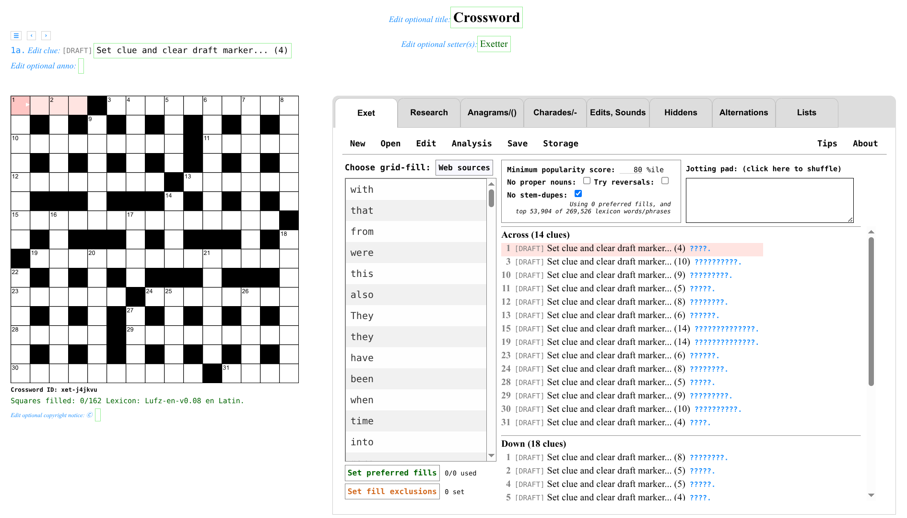

# Exet

## A web app for crossword construction

#### Version: Exet v0.28 February 10 2021

#### Author: Viresh Ratnakar

Exet is free, open source software for setting crosswords.
You can use Exet from my site, [exet.app](https://exet.app)
or you can download and use your own copy of the software from this
repository and a couple of files from
[Exolve](https://github.com/viresh-ratnakar/exolve).
These are all the files needed:
- [`exet.html`](https://raw.githubusercontent.com/viresh-ratnakar/exet/master/exet.html),
- [`about-exet.html`](https://raw.githubusercontent.com/viresh-ratnakar/exet/master/about-exet.html),
- [`exet-version.txt`](https://raw.githubusercontent.com/viresh-ratnakar/exet/master/exet-version.txt),
- [`lufz-en-lexicon.js.`](https://raw.githubusercontent.com/viresh-ratnakar/exet/master/lufz-en-lexicon.js),
- [`exolve-m.js`](https://raw.githubusercontent.com/viresh-ratnakar/exolve/master/exolve-m.js),
- [`exolve-m.css`](https://raw.githubusercontent.com/viresh-ratnakar/exolve/master/exolve-m.css),
- [`no-unches.png`](https://raw.githubusercontent.com/viresh-ratnakar/exet/master/no-unches.png),
  [`t-unches.png`](https://raw.githubusercontent.com/viresh-ratnakar/exet/master/t-unches.png),
  [`l-unches.png`](https://raw.githubusercontent.com/viresh-ratnakar/exet/master/l-unches.png),
  [`tl-unches.png`](https://raw.githubusercontent.com/viresh-ratnakar/exet/master/tl-unches.png),
  [`no-blocks.png`](https://raw.githubusercontent.com/viresh-ratnakar/exet/master/no-blocks.png).

Exet comes with a permissive MIT license. The full license notice is provided
in the [`LICENSE`](license) file.

Exet has no library/package/software dependencies. You should be able to use it
from any modern browser. The experience may not be great on smaller screens
like phones, though.

Exet saves all revisions of all crosswords that you work on, in the browser's
local storage. Exet never sends your crosswords to wherever it is getting
served from.

You can download the crosswords that you create with Exet in the
[Exolve](https://github.com/viresh-ratnakar/exolve) format or in the .puz
format. You can also grab embeddable HTML code for adding your crossword to any
web site or blog, using Exolve (but see the
[known caveats in the Exolve
documentation](https://github.com/viresh-ratnakar/exolve#exolve-widget)).

As of now, Exet only suggests English grid-fills (I'll add support for other
languages eventually).

I welcome [bug reports and feature
requests](https://github.com/viresh-ratnakar/exet/issues/new).
You may contact me via email too, at viresh at gmail dot com.

## Lexicon

The list of words used by Exet for providing grid-fill suggestions is a
modified version of the "UKACD" words list, which comes with its own
copyight notice that is reproduced below. I made the following modifications
to the UKACD words list:

- Removed a few swear words.
- Replaced all accented characters with non-accented ones.
- Deleted all punctuation characters other than spaces, hyphens, and apostrophes.
- Attached a popularity score to each word/phrase using a dump of all of Wikipedia's English-language articles.
- Created an index of the lexicon suitable for use by my JavaScript
  code. Source code for the last two steps is available in my
  [Lufz GitHub repository](https://github.com/viresh-ratnakar/lufz).

```
UKACD18
Copyright (c) 2009 J Ross Beresford
All rights reserved.

Redistribution and use in source and binary forms, with or without
modification, are permitted provided that the following conditions
are met:

1. Redistributions of source code must retain the above copyright
   notice, this list of conditions and the following disclaimer.

2. Redistributions in binary form must reproduce the above copyright
   notice, this list of conditions and the following disclaimer in the
   documentation and/or other materials provided with the distribution.

3. The name of the author may not be used to endorse or promote products
   derived from this software without specific prior written permission.

THIS SOFTWARE IS PROVIDED BY THE AUTHOR "AS IS" AND ANY EXPRESS OR
IMPLIED WARRANTIES, INCLUDING, BUT NOT LIMITED TO, THE IMPLIED WARRANTIES
OF MERCHANTABILITY AND FITNESS FOR A PARTICULAR PURPOSE ARE DISCLAIMED.
IN NO EVENT SHALL THE AUTHOR BE LIABLE FOR ANY DIRECT, INDIRECT,
INCIDENTAL, SPECIAL, EXEMPLARY, OR CONSEQUENTIAL DAMAGES (INCLUDING, BUT
NOT LIMITED TO, PROCUREMENT OF SUBSTITUTE GOODS OR SERVICES; LOSS OF USE,
DATA, OR PROFITS; OR BUSINESS INTERRUPTION) HOWEVER CAUSED AND ON ANY
THEORY OF LIABILITY, WHETHER IN CONTRACT, STRICT LIABILITY, OR TORT
(INCLUDING NEGLIGENCE OR OTHERWISE) ARISING IN ANY WAY OUT OF THE USE OF
THIS SOFTWARE, EVEN IF ADVISED OF THE POSSIBILITY OF SUCH DAMAGE.
```

## Crossword construction walk-through

To use Exet, you simply open a link to `exet.html`, such as [this one on
my site](https://viresh-ratnakar.github.io/exet.html), in a browser.

The first time you open Exet, it might take a while to load, as it fetches
a large (19 MB) lexicon file. I'll try to improve this in the future.

After it loads, your browser screen should look something like this:



Normally, Exet would start with the last crossword that you were working
on. When you open Exet for the very first time, it creates a 15x15
blocked grid of the British variety, with blocks added "automagically"
(see below). You can pass a URL option to default to a completely blank grid
as the first grid it creates:
[exet.html?newgrid=blank](exet.html?newgrid=blank).

There are three phases in crossword construction:

- Constructing the grid
- Filling the grid
- Providing the clues

Of course, setters often go back and forth and can overlap the phases (and Exet
certainly lets you do that). But a walk-through of Exet is perhaps best done by
separating out and describing these phases.

### Constructing the grid

You can navigate to any cell using the arrow keys or by clicking on it
(including the dark, block cells). The following controls are all available
from the "Edit" menu (as well as through some keyboard shortcuts listed below
and also shown in the menu):

- Add automagic blocks (#)
- Autofill:
- Accept autofilled entries (=)
- Toggle encircling (@)
- Toggle marking prefilled (!)
- Toggle block (.)
- Toggle bar-after (|)
- Toggle bar-under (\_)
- Clear all the lights

For the actions that modify the grid in non-cosmetic ways (.|\_#), symmetric
changes are automatically applied to the other end of the grid. This can be
turned off for an individual "Toggle bar/block" action by checking the
"Do not force symmetry on the next 'Toggle block/bar'" checkbox in the Edit
menu.

The "Open" menu allows you to start with blocked blank grids following a few
checkquered templates and the completely blank "No blocks" template. You will
also see a checkbox when creating a new blank grid, to "Add automagic blocks,"
and it will be checked by default (you can uncheck it if you do want to start
with a chequered template with no added blocks or with a completely blank
template).

"Add automagic blocks" essentially adds some blocks to the grid, while
maintaining the British chequered format (that has no consecutive unchecked
cells) or the American format (that has all cells checked), whichever of the
two formats is the state of the grid at that time. "Add automagic blocks"
can be used repeatedly.

Here's what "Add automagic blocks" does, in detail (whether you use it when
creating a new blank grid or whether you invoke it on an existing grid):
- It ensures that any added blocks continue to maintain symmetry and continue
  to maintain full cell connectivity (i.e., there is a path from every white
  cell to every other white cell, going through white cells only).
- First, it looks at what kind of grid is being used or created: if an existing
  grid has barred cells, then "Add automagic blocks" does not make any changes.
- It makes 0 or 1 random change to each row, and then 0 or 1 random change to
  each column, while maintaining certain grid properties as listed below.
- If an existing grid is of the American variety with every white square
  being a part of an across light as well as a down light (i.e., is "checked"),
  then, ensure that:
  - Every light is at least 3 letters in length.
  - Every white square is checked.
  - (Note that when you choose the "No blocks" menu choice while creating a new
    blank grid, "Add automagic blocks" will create an American grid variety.)
- Else, if an existing grid is of the British variety where the grid is
  chequered but there are no two adjacent unchecked cells, then, ensure that:
  - Every light is at least 4 letters in length.
  - There are no two adjacent unchecked cells.
  - Lights have fewer than or equal to as many unchecked cells as checked cells,
    unless they have 9 or more letters, in which case they can have one more
    unchecked cell than checked cells.
  - (Note that when you choose any of the chequered choices while creating a new
    blank grid, "Add automagic blocks" will create a British grid variety.)
- No cell where you've already entered a grid-fill letter will be turned into a
  block.

You can also open any existing HTML file that contains an puzzle in the Exolve
format (when you save such a crossword after editing it, the saved Exolve file
will replicate whatever is there before and after the Exolve part in the
original HTML file that you opened).

### Filling the grid

You can fill any light by typing into its cells. You can also use grid-fill
suggestions shown to the right of the grid (in the "Exet" tab). These grid-fill
suggestions are ordered by their popularity in English Wikipedia articles.

The grid-fill suggestions include phrases and hyphenated words. When you pick
these, the clue enum is automatically adjusted. For example, for 1A, if you
pick "birds of a feather," then the enum will automatically change to
(5,2,1,7).

As you progress through filling the grid, the software will try to help by
showing viability indicators (I call them "viablots"). These are red circles
that appear in light cells that have only a few available grid-fill choices.
The bigger the size, the more constrained a cell is. If you find yourself
in a state where absolutely no viable grid-fill is possible for some cells
(at least from the lexicon the software is using), the viablots in such
cells will be large and coloured purple. Your best recourse at that point is
to back-track by clearing out some neighbouring grid-fills, or use some other
lexicon source to find a word/phrase that works. Instead of filling in lots
of large purple viablots, only a few are coloured in a stand-out fashion, and
the rest are coloured in a non-distracting, near-transparent manner.

The grid-fill suggestions shown for a light take into account a limited
amount of look-ahead. What that means is that the software evaluates
each candidate suggestion for a light (that matches its crossing letters)
by checking if the choice leads to a dead-end for any of the crossing
clues. This sweep to weed out non-viable grid-fill suggestions happens in
the background, and also updates the viablots. When this background sweep
is going on, a flashing red indicator is shown under the grid, in the
bottom-right corner. You may notice grid-fill suggestions getting
modified while such a sweep is going on.

When Exet determines (using its lexicon) that for some unfilled cell, exactly
one letter choice is viable, it shows that letter choice in gray. You can press
"=" (or use the Edit menu's "Accept autofilled entries" option) to accept all
such autofilled letter suggestions.

You can provide up to 100 preferred words/phrases for using in the grid, by
clicking on the button labelled "Set preferred fills" in the Exet tab, just
under the column that shows grid-fill suggestions. This opens up a panel in
which you enter a set of preferred words/phrases (or edit the previously entered
set).  The words you provide here can be outside the lexicon too. These words
will get shown as the top suggestions, whenever possible. Clicking anywhere
outside the panel of preferred fills will dismiss the panel.

Similarly, you can provide a set of words that you do *not* want to appear
in the crossword, by clicking on the "Set fill exclusions" button. This
will open up a panel in which you can specify the following:

- A minimum "popularity" threshold. The lexicon ("ukacd18-lufz-v0.02 en Latin"
  as of Oct 2020) has 250,556 entries. Providing a popularity threshold can
  be useful to avoid obscure words as well as to make autofill go faster.
  Here's a guide to the number of entries that you will limit to, at various
  thresholds (recall that popularity is derived from occurrences in Wikipedia
  articles):

  | Threshold | #Entries | Last included entries    |
  |-----------|----------|--------------------------|
  |       0   | 250,556  | latirostral, Nance, Nancy |
  |       25  | 187,917  | pseudoscopes, washpot, whackiest     |
  |       50  | 125,278  | closed communities, forced sales, stannate |
  |       60  | 100,222  | ensnares, raun, clerical collar      |
  |       70  | 75,166  | leaseholder, delivery van, nays       |
  |       80  | 50,111  | in deep water, booing, ecco           |
  |       90  | 25,055  | solicitors, swifts, stele             |
  |       95  | 12,527  | Green Party, popular music, commector |

- Whether to exclude proper nouns.
- An explicit list of words/phrases to exclude.

Clicking anywhere outside the shown panel dismisses it.

#### Linked clues

You can link clues, creating sequences of lights that make up a single solution
that is clued using the "parent" clue (the first one in the sequence). To
create such linkages, you can click on the clue number of the current clue,
which will bring up a panel through which you can add a linked clue to the
current clue. The same panel also provides a button for breaking up a group
of previously linked clues. When you break up a group of linked clues, any
existing clue text from them will also get deleted.

Grid-fill suggestions as well as autofill work as you might expect with linked
clues.

#### Autofill

You can click on "Autofill" in the "Edit" menu to try to get the software to
fill all remaining entries. This may take a little while, but you can monitor
the progress and intervene if needed: From the Autofill menu panel, you can
click on "Pause"  to pause the Autofill (clicking on "Start" will resume it).
You can accept or clear the Autofill suggestions by clicking on the "Accept"
/ "Clear" buttons, respectively, when Autofill is paused or has finished.

Note that Autofill tries to prefer words/phrases in the "preferred fills" list.
Autofill also respects the "fill exclusions" settings (min-popularity,
exclusion of proper nouns, as well as any entries in the explicitly forbidden
list).

Autofill randomizes its choices to an extent. You can run it repeatedly
to get slightly different results every time, until you are satisfied with
the fills.

A good way to make use of Autofill is stop it as soon as it picks a
word that you do not like. You can then accept the suggestions and clear
the word(s) that you do not like (you may also consider adding them to the
"Set fill exclusions" list). Then, you can resume Autofill and repeat the
process.

Autofill may take a while (2+ minutes), especially for barred grids and
American-style grids. I'll try to improve its performance over time.

### Providing the clues

The clue for the current light is shown above the grid and can be edited in
place right there. You can navigate through the clues using standard
controls such as clicking on a cell or a clue, using the arrow keys, or
using the tab and shift-tab keys.

You can also edit the enum part of the clue, but the software will reset it
if it does not add up to the needed number. For example, if a light spans 10
cells, and you edit the anno to be "(5-4)," the software will reset it to
"(10)."

You can optionally provide annotations for clues. These annotations are used
in cryptic crossword solutions, typically, to describe the cryptic wordplay.

When creating a clue for a word or a phrase, setters typically like to
look at the definition of the word/phrase, look at its synonyms, examples of
usage, pronunciation, and etymology. The "Dictionaries" tab lets you do that
by using reputed online resources, conveniently linking directly to the
word/phrase in the current light:

- **Chambers Dictionary & Thesaurus**: [https://chambers.co.uk](https://chambers.co.uk)
- **The Free Dictionary**: [thefreedictionary.com](https://thefreedictionary.com)
- **Google Dict**: [api.dictionaryapi.dev](https://api.dictionaryapi.dev)
- **Etymonline**: [www.etymonline.com](https://www.etymonline.com)

For cryptic crosswords, these additional tabs might be of use to setters. These
are:

- **Charades...**: Shows candidate charade wordplays, including anagrams and
  containers, wordplays for the current light, sorted in decreasing order of
  the average length of wordplay components.
- **Anagrams...**: Uses [nutrimatic.org](https://nutrimatic.org) to show
  meaningful anagrams of the current light. The Nutrimatic anagrams may cover
  more possibilities than the anagrams shown in the Charades tab, as the
  anagrams shown in the Charades tab are restricted to words and phrases in the
  lexicon. This tab also shows a panel with possibilities for composite
  anagrams (which can also be used for creating anagrams with deletions).
- **Hidden...**: Uses [nutrimatic.org](https://nutrimatic.org) to show meaningful
  "hidden word" and "reversed hidden word" wordplay ppossibilities for the
  current light. Setters can tweak the wordplay as they choose.
- **Alternations...**: Uses [nutrimatic.org](https://nutrimatic.org) to show
  "alternation" and "reversed alternation" wordplays for the current light.
- **Lists**: This is not specific to the current light. This tab provides
  convenient links to curated lists of wordplay indicators (for wordplays of
  various types) and acceptable cryptic abbreviations. The source is
  mostly the [Crossword Unclued](https://www.crosswordunclued.com) blog
  (and Wikipedia).

### Final touches

Do give your crossword a meaningful title, and provide your name/pseudonym as
the setter. These fields can be seen at the top of the page and can be directly
edited. Similarly, you can edit the copyright notice for the puzzle. All three
of these editable fields are optional, and you can simply edit them to be
empty.

### Downloading Exolve or .puz files

The "Save" menu lets you download or grab the puzzle in various ways. In the
following, a \* in a filename stands for the puzzle title preceded by a hyphen
(unless the puzzle title is blank).

- **Download PUZ file (exet\*.puz)**: Download a .puz file. Note that .puz
  does not support many crossword features (afaik) such as barred grids.
  The software will alert you if it is not able to provide a .puz download.
- **Download Exolve file with solutions (exet-exolve\*-solved.html)**: Download
  an HTML file that uses Exolve and that allows solvers to check/see solutions.
  Such files can also be opened by Exet from the "Open" menu and can be further
  edited. This might be useful, for example, when you want to edit an old
  crossword that you have deleted from Exet's limited local storage.
- **Download Exolve file without solutions (exet-exolve\*-unsolved.html)**:
  Download an HTML file that uses Exolve and does not allow solvers to check/see
  solutions.
- **Copy Exolve widget code with solutions 📋**: Copy (into the clipboard)
  embeddable Exolve widget HTML code (with solvers able to check/see solutions).
- **Copy Exolve widget code without solutions 📋**: Copy (into the clipboard)
  embeddable Exolve widget HTML code (with solvers not able to check/see
  solutions).
- **Print or download PDF file with solutions**: Print the crossword, or save
  it as a PDF file, in a compact, two-column format, with solutions.
- **Print or download PDF file without solutions**: Print the crossword, or save
  it as a PDF file, in a compact, two-column format, without solutions.

In the first three "download" variants, a file with the name shown will be
downloaded into the browser's Downloads directory/folder. If there already
exists a file with that name, the system will use a variant of the name
as per its usual conventions.

The Save menu also lets you change a couple of settings:

- **Show enums in clues**: You can turn this off to download American-style
  puzzles that do not show enums in clues.
- **Exolve URL prefix**: You can change this to your own custom location
  of the `exolve-m.css` and `exolve-m.js` files in downloaded Exolve files.
  You can press the Escape key inside the text entry area to revert to the
  default value of `https://viresh-ratnakar.github.io/`. Note also that if you
  load an existing HTML file containing an Exolve-formatted puzzle, then when
  you modify the puzzle and download as Exolve subsequently, the downloaded
  file will simply copy everything (other than the modified puzzle specs)
  from the original file, including the URL prefix (i.e., this setting will
  not get used).

These Save settings are sticky: Exet saves their current values in local
storage.

### Going back to older versions

The "Open" menu lets you pick any old revision of any crossword. It also shows
a preview of the puzzle revision that you select.

Browsers typically limit the amount of local storage (5 MB in Chrome as of
September 2020). When this limit is reached, Exet will warn you that it cannot
save crossword revisions. You can use the "Manage storage" menu option in the
"Open" menu at any time to delete old revisions of some crosswords and/or
entirely delete old crosswords (after downloading Exolve files with solutions
for them as these files can be opened in Exet to recover the crosswords
completely).

## Analysis

The Exet tab also has an "Analysis" link. When you click on that, a panel opens
up, showing various analyses of the grid, the grid-fill, the clues, and the
annotations. Here is an illustrative example of the kinds of analyses shown:

> **Grid**
> 
> - 225 cells, dimensions: 15 × 15
> - All light cells are connected
> - Symmetric
> - 70 (31.11%) blocked cells
> - No bars
> - No consecutive unches
> 
> **All/Across/Down Grid-fills and Clues**
> 
> - Number of lights: 29
> - Filled lights: 29 (100.00%)
> - Clues needed (excluding linked "child" lights): 29
> - Clues set: 29 (100.00%)
> 
> - Light lengths:
> 
>   - 2	occurrences of	4	
>   - 4	occurrences of	5	
>   - 6	occurrences of	6	
> 
>     ...
> 
>   Distinct values: 8
> 
>   Range: 4 - 15, Average: 7.3, Median: 7
> 
> - Words repeated in clues:
> 
>   - 6	×	of	
>   - 4	×	to	
>   - 3	×	perhaps	
>   - 2	×	wild	
> 
>     ...
> 
>   Distinct values: 23
> 
> - Annotations provided: 29 (100.00%)
> 
>   - 6	×	charade or other	
>   - 3	×	anagram around	
>   - 3	×	anagram	
>   - 2	×	in	
>   - 2	×	in anagram	
> 
>     ...
> 
>   Distinct values: 17
> 
> - Letters used:
> 
>   - 20	×	E	
>   - 15	×	A	
>   - 13	×	I	
> 
>     ...
> 
>   Distinct values: 21
> 
> - Word/phrase popularities:
> 
> 
>   - 3	occurrences of	65	
> 
>     ...
> 
>   - 2	occurrences of	90	
>   - 7	occurrences of	95	
>   - 3	occurrences of	100	
> 
>   Distinct values: 13
> 
>   Range: 0 - 100, Average: 75.3, Median: 85

### A few notes about these analyses:

- You can toggle between "All" and "Across" and "Down" when looking at the
  analyses of grid-fills and clues/annotations.
- All histograms are shown with adjoining bar graphs.
- You can hover the mouse over the bars to see details (lists of relevant
  clues/lights).
- The analysis of annotations is a somwehat experimental feature that
  tries to provide a breakdown of clue types by assuming a specific
  annotation style in which clue type names and cryptic wordplay operations
  are interspersed with indicators, fodders shown within parantheses or curly
  braces. For example:

  - \~{Old car}\~ part, later redesigned to limit wastage, essentially (10)
     PARTLATER\* {... redesigned} around {... to limit ...} (-was)T(-age)
     {... essentially}.
  - \~{Instrument}\~ platform's bottom aboard rickety boat leaked water (10)
    (-platfor)M {...'s bottom} in {aboard} BOAT\* {rickety ...} + URINE
    {leaked water}.

  Note that the definition part is marked above with \~{...}\~, as per the
  Exolve convention.

## Supported crossword features

### Annotations

As noted in the "Analysis" section, the definition part of a cryptic clue
can be marked with  \~{...}\~ in the clue itself.

### Hyphens and spaces

### Barred and blocked grids

### Circles and prefills

## Features easy to add with some post-editing

In the Exolve format, you can simply edit the downloaded file (which is in a
simple plain-text format described in detail in the
[Exolve README file](https://github.com/viresh-ratnakar/exolve/blob/master/README.md))
to add any of the following features.

- Ninas, preambles, explanations
- Diagramless puzzles
- Jigsaw puzzles

After you make any such changes, you can open the edited file in Exet and
continue to work on it further if you want to (it will show up as a revision
to the same puzzle, as it will have the same exolve-id). The added features
(preamble/nina etc.)  will then be visible in Exet and will be retained in all
subsequent downloads (but you just won't be able to edit them within Exet).

## Not yet supported features

### Diagramless puzzles

### Other languages and lexicons

## Notes and acknowledgements

- [Qxw](https://www.quinapalus.com/qxw.html) is excellent free software for
  crossword construction that I have been using extensively. I found myself
  jumping from Qxw to various online resources during the clue-setting phases
  of crossword construction, and have tried to make these resources
  readily accessible in-context within Exet.
- Qxw also provides [links to the original versions of many word
  lists](https://www.quinapalus.com/xwfaq.html), (including UKACD18, the one
  that I used).
- The "viablots" that I display in Exet are inspired by a similar construct
  in Qxw.
- I added Wikipedia-importance scores to the lexicon using code
  ([Lufz](https://github.com/viresh-ratnakar/lufz)) inspired by the the code
  used in the [Nutrimatic project](https://github.com/egnor/nutrimatic).
- I used this [.puz format
  documentation](https://code.google.com/archive/p/puz/wikis/FileFormat.wiki)
  to write code to create .puz-formatted output. This mostly worked, except
  that I had to fix a bug (the checksum computation needs to make sure that
  it does not overflow beyond 16 bits). I found the bug by looking at the
  [puzpy code](https://github.com/alexdej/puzpy).
- The composite anagram builder was inspired by similar constructs in Qxw
  as well as in
  [martindemello.net/wgn.html](http://martindemello.net/wgn.html).

